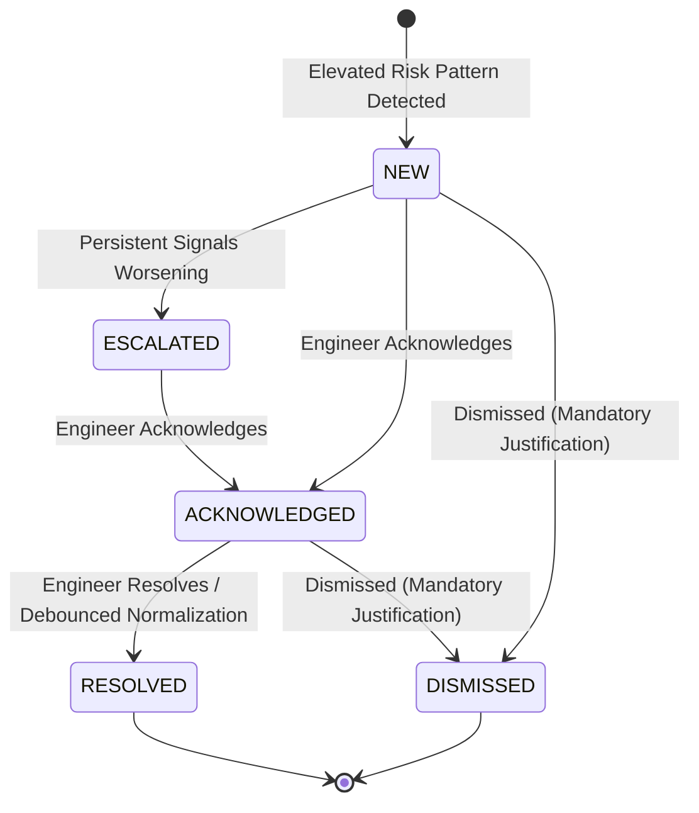

# NWIS Stage 03: Alert Lifecycle & State Machine

## 1. State Machine
NWIS strictly controls operational alert transitions:

---

## 2. Deduplication & Cooldown
- To prevent alert flooding (e.g. high torque continuing for 10 minutes generating 600 alerts), NWIS maintains an active alert session.
- Ongoing samples update the active alert with:
  - `peakScore`
  - `durationSeconds`
  - `lastTriggeredAt`
  - Updated factor contributions

---

## 3. Debounced Auto-Resolution
- When telemetry signals return to nominal baselines, NWIS does **NOT** resolve immediately.
- It requires **4 consecutive normal samples** (`DEBOUNCE_SAMPLES_FOR_RESOLUTION = 4`) to prevent flickering.

---

## 4. Immutable Audit Trail
Every transition produces an append-only `AlertEvent` record:
- `action`: `CREATED`, `ESCALATED`, `ACKNOWLEDGED`, `RESOLVED`, `DISMISSED`
- `actor`: User persona or `SYSTEM`
- `previousState` &rarr; `newState`
- `reason`: Mandatory text description
- `timestamp`: UTC timestamp
