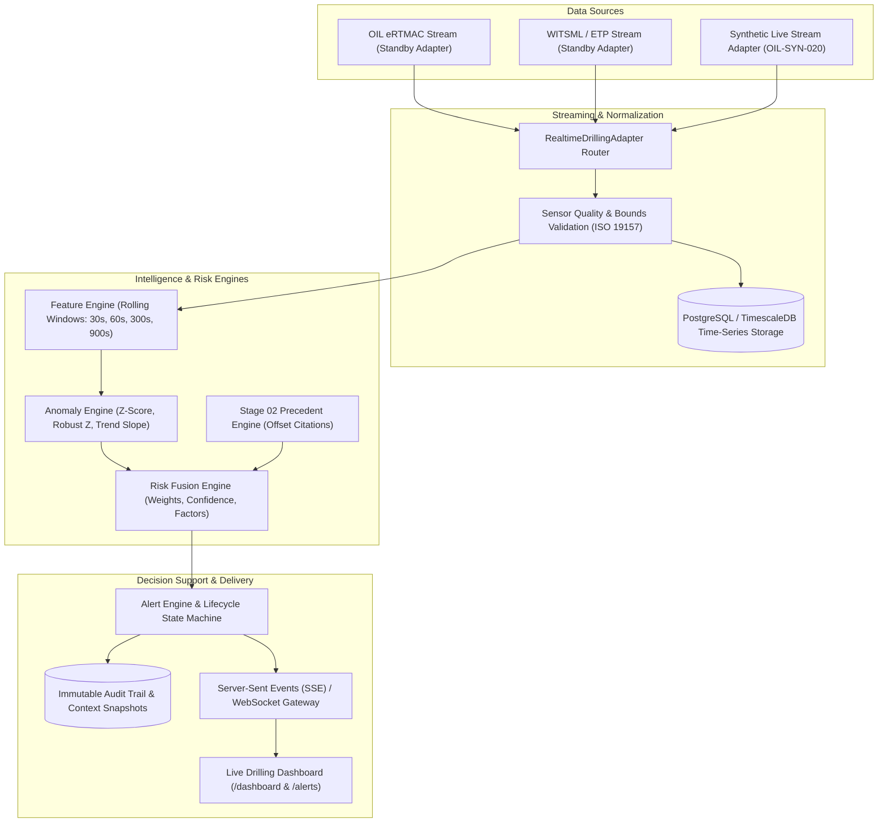

# NWIS Stage 03: Real-Time Drilling Intelligence Architecture

## 1. Executive Summary
**Nearby Wells Intelligence System (NWIS)** Stage 03 introduces **Real-Time Drilling Intelligence** designed for Oil India Limited (OIL).
NWIS serves strictly as a **decision-support copilot** for drilling engineers, superintendents, and geologists. It continuously ingests high-frequency drilling telemetry, extracts rolling statistical trends, flags multi-signal physical anomalies, evaluates modular operational risks, and immediately corroborates patterns against institutional memory (offset well precedents and verified geological completion reports).

> **CRITICAL DISCLAIMER:**
> NWIS is a **decision-support advisory system**. It does **NOT** autonomously control drilling equipment or rig actuators. It never issues automated changes to WOB, RPM, mud weight, pump rate, or standpipe pressure.

---

## 2. Real-Time Data Pipeline Architecture

---

## 3. Core Engine Responsibilities

1. **Stream Adapters (`RealtimeDrillingAdapter`)**:
   - `SyntheticLiveStreamAdapter`: Generates realistic drilling telemetry with physics-based perturbations and intentional scenario injections.
   - `ERTMACAdapter`: Production placeholder for Oil India Limited eRTMAC network conduit.
   - `WITSMLLiveAdapter`: Production placeholder for external WITSML 1.4.1.1/2.0 servers.

2. **Feature Engine (`FeatureEngineService`)**:
   - Computes rolling mean, rolling median, sample standard deviation, median absolute deviation (MAD), linear trend slope, and percentage baseline deviations across 30s, 60s, 300s, and 900s windows.

3. **Anomaly Engine (`AnomalyEngineService`)**:
   - Deterministic and statistical anomaly detection (Rolling Z-Score > 2.8, Robust Z > 3.0, ROP negative trend slope < -0.05).

4. **Risk Fusion Engine (`RiskFusionEngine`)**:
   - Synthesizes outputs from `StuckPipeRiskEngine`, `LostCirculationRiskEngine`, `KickRiskEngine`, `TorqueRiskEngine`, and `CementingRiskEngine`.
   - Directly calls Stage 02's `PrecedentEngineService` to retrieve matching offset well citations (`OIL-SYN-003`, `OIL-SYN-007`, `OIL-SYN-012`).

5. **Alert Engine (`AlertEngineService`)**:
   - Manages the alert lifecycle (`NEW` &rarr; `ACKNOWLEDGED` &rarr; `ESCALATED` &rarr; `RESOLVED` / `DISMISSED`).
   - Implements alert deduplication, cooldown, debounced auto-resolution, and append-only audit event logging.
