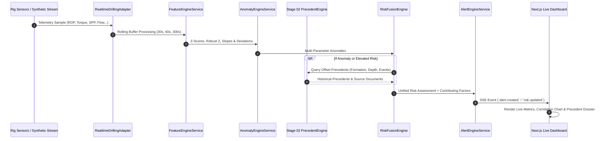

# NWIS Architecture: Real-Time Intelligence & Precedent Fusion

## 1. End-to-End Pipeline Architecture

## 2. Storage Strategy
- High-frequency telemetry: PostgreSQL `realtime_drilling_samples` indexed by `(wellId, timestamp)` and `(wellId, measuredDepth)`.
- Derived features: `realtime_features` indexed by `(wellId, windowSeconds)`.
- Context snapshots: `context_snapshots` frozen at the exact second a Warning or Critical alert triggers for post-incident engineering review.
