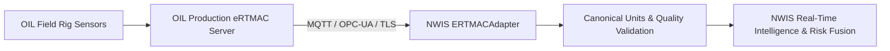

# Future Production Integration: Oil India Limited (OIL) eRTMAC

> **CRITICAL DISCLAIMER:**
> Production integration requires formal confirmation, security clearance, and authorized network access from Oil India Limited (OIL).
> This document details the architectural interface specifications designed into NWIS to enable seamless production deployment without refactoring core intelligence engines.

---

## 1. What NWIS Expects from OIL eRTMAC
NWIS expects a continuous telemetry stream conforming to standard drilling instrumentation:
- **Sampling Frequency**: 1 Hz to 0.2 Hz (1 to 5 second intervals).
- **Transport Protocols**: MQTT over TLS, OPC-UA, or WITSML / ETP (Energistics Transfer Protocol).
- **Key Parameters**:
  - Measured Depth (MD) & True Vertical Depth (TVD)
  - Rate of Penetration (ROP)
  - Weight on Bit (WOB)
  - Rotary Speed (RPM)
  - Surface Torque
  - Standpipe Pressure (SPP)
  - Flow In & Flow Out
  - Active Pit Volume
  - Mud Weight In / Mud Weight Out
  - Hookload & Pick-up/Slack-off Overpull Drag

---

## 2. Architectural Connector Mapping

The `ERTMACAdapter` class (`apps/api/src/realtime/adapters/ertmac-live.adapter.ts`) implements the `RealtimeDrillingAdapter` interface. In production:
1. Environment variables (`OIL_ERTMAC_ENDPOINT`, `OIL_ERTMAC_CLIENT_CERT`, `OIL_ERTMAC_API_KEY`) are populated.
2. In `RealtimeModule`, the provider binding is switched from `SyntheticLiveStreamAdapter` to `ERTMACAdapter`.
3. The underlying normalization, feature windowing, anomaly detection, precedent matching, and alerting engines require **zero** modification.

---

## 3. Security & Network Considerations
- **Air-Gapped / Demilitarized Zone (DMZ)**: NWIS supports on-premise edge deployment within OIL's secure operational network (OT network).
- **Authentication**: Mutual TLS (mTLS) with X.509 client certificates and role-based token credentials.
- **Audit Logging**: All telemetry samples, alerts, and engineering actions produce append-only audit events for regulatory compliance.
